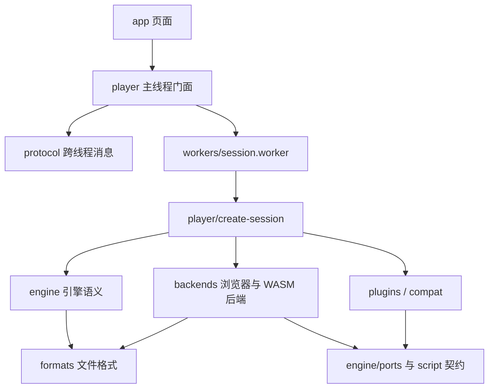

# krkr2-web 架构规划

规划日期：2026-09-13。本文描述目标结构与实施顺序。当前已落地会话 Worker、独立 TJS2 WASM、异步宿主桥、基础资源与图层链路；详细实现范围见 [当前兼容范围](compatibility/current.md)。目录图仍包含后续阶段的目标模块，不代表全部已经实现。

建议采用 **TypeScript 实现引擎主体，Web API 提供平台能力，小型 WASM 模块负责 TJS2 与必要的专用算法** 的路线。先维持一个 Vite 工程，按职责建立模块边界，等出现独立使用者或构建需求后再拆 npm 包。

这里按“尽量使用 Web 原生技术，同时以运行现有游戏为目标”设计。兼容目标是游戏能观察到的脚本、资源、绘图、声音和存档行为，内部结构可以重新设计。纯 TypeScript TJS VM 可以成为后续方向，但第一阶段先隔离、复用 TJS2，避免同时重写脚本语言和整个引擎。

**1. 参考项目能提供什么**

已检查相邻的 `kirikiroid2-web` 仓库。下表是其当前本地实现的结构观察，不代表已经验证了原引擎全部行为。

| 已检查的位置 | 观察 | 新项目的处理 |
| --- | --- | --- |
| `cpp/core/tjs2/` 及其 `CMakeLists.txt` | TJS2 已有独立静态库目标，但仍依赖 Boost locale、日志、正则等库 | 抽取 VM，审计实际依赖；通过窄接口接入 TS，不能假定直接复制目录即可独立编译 |
| `cpp/core/base/ScriptMgnIntf.cpp` | 注册 Window、Layer、KAGParser 等脚本对象并执行启动脚本 | 将启动过程、TVP 对象绑定与 VM 分开 |
| `cpp/core/base/KAGParser.cpp` | 提供供游戏脚本使用的 KAGParser | 兼容该接口，运行游戏自带的 TJS/KAG 框架 |
| `cpp/core/base/StorageIntf.cpp`、`XP3Archive.cpp` | 资源定位与归档读取属于不同层次 | 分开存储命名语义、归档格式、实际文件来源 |
| `cpp/core/visual/`、`cpp/core/environ/` 及其构建配置 | 图层与平台实现连接到 Cocos2d 等原生依赖 | TS 保留图层语义，浏览器后端负责显示和输入 |
| `VirtualLazyFS.h`、`platforms/web/vlfs.js` | Blob/Range/OPFS、写覆盖层、JSPI 与 pthread 代理共同衔接文件读取 | 参考按需读取思路，重新设计异步边界与所有权 |
| `platforms/web/shell.html` | 页面、启动和浏览器集成集中在较大的入口文件 | 拆成应用 UI、会话装配与浏览器适配器 |
| `tests/unit-tests/`、`tests/differential/` | 存在脚本、插件和差分测试材料 | 按来源和已验证范围挑选可复用案例，作为兼容测试起点 |

参考项目的源码结构复原目标属于它自己的工程；本项目按当前的 Web 原生目标设计。参考项目的已知偏差也要记录，不能把它的一切输出自动当成原引擎标准。

**2. 技术分工**

| 能力 | 首选实现 | 边界与理由 |
| --- | --- | --- |
| 游戏库、导入、设置、调试面板 | TypeScript + HTML/CSS | UI 框架留在 `app/` 内；现阶段原生 DOM 足够 |
| 生命周期、事件调度、TVP 对象 | TypeScript | 引擎不依赖 DOM、Vite 或某个 UI 框架 |
| TJS 源码与字节码执行 | 单独的 TJS2 WASM 后端 | 保留语言语义；不把 TJS 文本替换成 JS 后交给 `eval` |
| KAGParser | TypeScript | 提供兼容接口；游戏的宏、扩展和流程继续由其脚本控制 |
| Layer、Bitmap、转场、命中检测 | TS 语义模型 + WebGL2 后端 | 先有明确的绘图操作与像素语义，再接 GPU |
| 文本 | Canvas 系统字体 + 独立 FreeType WASM 文件字体 | TypeScript 控制布局和覆盖值合成；文件字体的度量差异已有测量依据 |
| 文件索引、XP3/ZIP 结构解析 | TypeScript + DataView | 压缩、专有编码等算法可独立使用 WASM |
| 资源来源 | File/Blob、Fetch、可选文件系统句柄 | 文件来源不决定引擎的资源查找规则 |
| 游戏库与小型存档持久化 | IndexedDB | 使用事务提交；大资源缓存交给 OPFS |
| 声音 | Web Audio，流式 PCM 按需接 AudioWorklet | 引擎维护音轨、循环点和事件，后端执行播放 |
| 视频 | 浏览器媒体元素优先；需要逐帧合成时接 WebCodecs | 按实际容器和 codec 检测支持；专有格式后续独立补充 |
| TLG、特殊解码与热点像素算法 | TS 优先，必要时小型 WASM | 以正确性、测量结果和维护成本决定，不整体引入旧媒体栈 |
| 原生插件兼容 | TS 插件模块，必要时附带独立 WASM | 根据 DLL 名注册兼容实现，按实际接口补齐 |

默认渲染位置是会话 Worker。OffscreenCanvas 可以移交到 Worker，但仍须实际创建目标绘图上下文来检测支持情况。[OffscreenCanvas 文档](https://developer.mozilla.org/en-US/docs/Web/API/OffscreenCanvas)

WebGPU 留作后续后端，第一版先实现 WebGL2。当前 WebGPU 文档仍标注有限可用性，因此不把它设为启动门槛。[WebGPU 文档](https://developer.mozilla.org/en-US/docs/Web/API/WebGPU_API)

**3. 目标目录**

下面是职责地图，按阶段创建有实现的目录；不一次生成全部空目录或占位类。标注“后续”的部分不属于第一版交付。

```text
krkr2-web/
├── index.html
├── package.json
├── package-lock.json
├── vite.config.ts
├── tsconfig.json                   # 项目引用入口，按需拆分各运行环境配置
├── tsconfig.engine.json            # 引擎/格式：ES 类型，无 DOM
├── tsconfig.window.json            # 页面与主线程后端：DOM 类型
├── tsconfig.worker.json            # Worker：WebWorker 类型
├── src/
│   ├── main.ts                     # 页面启动入口
│   ├── app/                        # 产品 UI
│   │   ├── library/                # 游戏列表、最近游玩
│   │   ├── importer/               # 文件/目录选择与导入进度
│   │   ├── player/                 # 游戏画布容器、工具栏
│   │   ├── settings/
│   │   ├── devtools/               # 日志、图层、资源和性能面板
│   │   └── styles/
│   ├── player/                     # 对外播放器门面与装配层
│   │   ├── create-player.ts        # main-thread API、会话生命周期
│   │   ├── create-session.ts       # Worker 内装配引擎与具体后端
│   │   ├── session-client.ts       # 封装 RPC，不暴露给 UI 组件
│   │   └── capabilities.ts        # 能力探测与后端选择
│   ├── protocol/                   # 跨线程 DTO、命令、事件、版本
│   │   ├── session.ts
│   │   ├── input.ts
│   │   ├── media.ts
│   │   └── diagnostics.ts
│   ├── pwa/                        # 应用级离线能力，不进入引擎资源层
│   │   ├── client.ts               # 注册、状态与显式更新
│   │   ├── manifest.ts             # 发布清单与预算
│   │   ├── cache.ts                # 校验下载与版本缓存
│   │   └── service-worker.ts       # 浏览器生命周期与作用域隔离
│   ├── engine/                     # 与浏览器宿主解耦的引擎语义
│   │   ├── session.ts              # 启动、暂停、停止的状态机
│   │   ├── scheduler/              # 逻辑时钟、事件队列、VM 执行门控
│   │   ├── tvp/                    # Window、Layer、System 等 TJS 对象绑定
│   │   ├── scene/                  # 图层树、位图状态、坐标与命中规则
│   │   ├── graphics/               # 像素操作、混合/转场语义、文本布局
│   │   ├── storage/                # 路径、auto-path、挂载优先级、写覆盖层
│   │   ├── script/                 # ScriptRuntime、值类型、宿主对象契约
│   │   ├── kag/                    # KAGParser 兼容实现
│   │   ├── media/                  # 音轨/视频状态、循环点、完成事件
│   │   ├── plugins/                # 注册、链接、依赖和卸载语义
│   │   ├── diagnostics/            # 结构化日志与追踪事件
│   │   └── ports/                  # 文件、绘图、音频、视频、时钟等接口
│   ├── formats/                    # 文件格式与字节处理，不访问 DOM/网络
│   │   ├── binary/                 # 边界检查、整数、字节流读写
│   │   ├── xp3/                    # 头、索引、分段、过滤器接口
│   │   ├── zip/                    # 游戏导入容器
│   │   ├── text/                   # 脚本文本编码与标记识别
│   │   ├── audio/                  # WAV、MIDI、SLI 与编码元数据
│   │   ├── image/                  # PNG、GIF、BMP 及 tlg/ 子模块
│   │   └── psb/                    # 后续，按插件需要实现
│   ├── backends/                   # 具体实现，依赖 engine 的接口
│   │   ├── script/tjs-wasm/        # VM 加载、值转换、句柄、异步宿主桥
│   │   ├── files/                  # Blob、HTTP Range、OPFS、IndexedDB
│   │   ├── render/webgl2/          # GPU 资源、绘图目标、shader、提交
│   │   ├── text/browser/           # Canvas 系统字体、缺字回退和后端选择
│   │   ├── text/freetype/          # 独立文件字体内核加载、面对象和覆盖值
│   │   ├── audio/                  # Worker 解码、端口后端和无界面验证
│   │   │   └── web/               # AudioContext、PCM 传输、mixer.worklet.ts
│   │   ├── video/browser/          # 媒体元素；WebCodecs 后续独立加入
│   │   └── codecs/                # 浏览器解码器及专用 WASM 的适配
│   ├── plugins/                    # 具体的兼容插件，按功能/模块组织
│   │   ├── registry.ts             # 可用插件 manifest 与惰性加载入口
│   │   └── ...                     # 有目标游戏需要时再加入
│   ├── compat/                     # 兼容配置，与通用机制分开
│   │   ├── profiles/               # 引擎版本/游戏资源指纹对应的配置
│   │   └── feature-status.ts       # implemented / partial / unsupported
│   └── workers/                    # 执行环境入口，保持薄层
│       ├── session.worker.ts       # 显式持有、可销毁重建的会话 Worker
│       └── codec.rpc.ts            # 后续，有界的无状态计算任务
├── native/                         # 仅独立 WASM 模块的桥与构建
│   ├── CMakeLists.txt
│   ├── tjs2/                       # 窄 C ABI、宿主对象适配、构建配置
│   └── codecs/                     # 按需添加的解码/像素算法桥
├── third_party/                    # 固定版本的外部源码及许可证
│   └── tjs2/                       # 来源、版本、补丁记录随模块保存
├── scripts/                        # WASM 构建、产物清单、兼容报告工具
├── tests/
│   ├── conformance/                # TJS/TVP/KAG/存储行为契约
│   ├── integration/                # VM→TVP→资源/绘图完整链路
│   ├── browser/                    # 真实浏览器、能力降级、重启/恢复
│   ├── differential/               # 对参考实现的输出/事件/像素比较
│   └── fixtures/                   # 小型可分发案例、来源与期望值
├── benchmarks/                     # 启动、读放大、内存、绘图、音频指标
├── docs/
│   ├── architecture.md
│   ├── decisions/                  # M0 起记录已经验证的关键决策
│   └── compatibility/              # API 覆盖、案例结果、已知差异
├── public/                         # 图标、manifest 等静态文件，按需添加
├── .generated/                     # WASM/胶水/产物清单，不入库
└── dist/                           # Vite 发布产物，不入库
```

单模块单元测试就近放在源码旁，例如 `formats/xp3/index.test.ts`。跨模块的行为验证放 `tests/`。`app/player/` 只有界面，`src/player/` 是可以供其他页面嵌入的播放器 API，两者职责不同。

早期不引入 monorepo 管理器、服务端、容器或插件包发布体系。若将来 XP3 工具或播放器 SDK 确有独立使用者，再提取相应模块；目录边界现在就可以约束依赖。

**4. 依赖方向**



主线程通过 Vite 的模块 Worker 入口创建会话，通过 RPC 发送命令，不直接执行 Worker 实现。具体约束如下：

- `engine/`、`formats/` 不导入 `app/`、`player/`、`backends/`、`workers/`，不直接读取 `window`、`document`、`navigator`。
- `formats/` 只消费字节或注入的读取/解压接口，不知道 URL、OPFS 路径或游戏会话。
- `backends/` 实现引擎拥有的接口，后端选择由装配层完成；不要在 `Layer` 中写浏览器型号分支。
- `protocol/` 只放可传输的数据契约，不放引擎对象、TJS 指针、纹理对象或运行逻辑。
- 不同后端通过端口或装配层连接，避免音频后端直接依赖具体文件后端。
- 用 import 限制规则和分开的 TS 配置执行边界；主线程、Worker、AudioWorklet 分别检查实际可用全局对象。
- 新增的通用接口必须对应当前实际使用路径，不为尚未实施的第二种后端制造完整抽象层。

**5. 线程、通信与状态所有权**

| 执行环境 | 拥有的状态 | 不承担的工作 |
| --- | --- | --- |
| 主线程 | 页面、输入采集、AudioContext、媒体元素、会话客户端 | VM 执行、XP3 解压、图层语义运算 |
| 会话 Worker | 一份 VM、一份引擎状态、资源索引、图层/位图、默认渲染后端 | DOM 操作、直接创建主线程音频图 |
| Codec Worker，按需启用 | 独立任务和有界缓存 | 游戏会话全局变量、图层对象、TJS 对象 |
| AudioWorklet，按需启用 | PCM 队列、采样位置与实时处理状态 | 资源查找、脚本执行、文件读取和重型解码 |

先把 VM 与 renderer 放在同一 Worker，避免每次 `Layer` 属性访问、像素读取都跨线程。GPU 提交和逻辑推进分开计量；只有性能证据表明需要时才拆独立渲染 Worker。浏览器不支持目标 OffscreenCanvas 上下文时，可以另做主线程渲染后端，但必须通过同一绘图协议和兼容测试后才列为支持。

已实现的图形恢复通过 Renderer 状态订阅通知会话：上下文丢失只丢弃 GPU 资源，VM 和 CPU 像素保留；图形暂停与用户暂停独立，首帧重建并提交后才解除图形暂停。声音、视频、计时器及转场沿用对应暂停接口；失败可重试显示或导出存档。该链路不重建 VM，也不把纹理句柄传到主线程，见 [图形恢复决策](decisions/019-graphics-recovery.md)。

当前安装的 `vite-plugin-worker-rpc@0.4.0` 文档确认：默认是自动线程池；各 Worker 的模块状态独立；即便 `pool: 1`，异步请求仍可能交错执行。自动生成的代理没有生命周期接口；公开的 `vite-plugin-worker-rpc/runtime` 则提供 `createRpcClient`、`dispose` 和 `exposeRpc`。因此计划采用：

- `session-client.ts` 使用 `createRpcClient(workerFactory, { pool: 1 })`，工厂显式创建 `session.worker.ts` 模块 Worker；Worker 端用 `exposeRpc` 接入。一页先只允许一个活动游戏会话。
- `session.worker.ts` 暴露 `initialize / mount / start / pause / resume / stop / inspect` 这类粗粒度操作，实际逻辑留在普通 TS 模块。客户端封装有类型的接口，字符串方法分发局限在这一处。
- 会话再有自己的顺序执行队列和 VM 门控。单 Worker 不等于自动保证一次只执行一个异步会话操作。
- 输入批次、声音命令和遥测通过明确的 MessagePort 通道传送，携带 session generation、序号与时间戳；过期会话的完成消息不得写入新会话。
- 高流量数据用 transferable ArrayBuffer/ImageBitmap；所有权转移后发送方不能继续使用。像素和 PCM 不逐元素 RPC。
- Codec 任务以后再使用显式有界池。显式 `?pool=N` 导入需要相应类型声明；从 RPC 实现内导入另一 RPC 模块会作为本地依赖执行，不能靠这种写法创建嵌套线程池。
- 引擎挂起期间，外部事件先入队。资源读取完成和媒体响应必须能绕过“等待 VM 完成”的命令队列，否则会形成自等待。
- RPC 超时不代表取消。采用 operation ID、取消消息、AbortController 和 generation 丢弃迟到结果；纯计算死循环由主线程超时处置、终止并重建 Worker。

RPC 插件的 pool 默认值、代理对象、超时和销毁限制以当前安装版本的 `README.md`、`runtime.d.ts` 和 package exports 为依据。`pool: 1` 仅约束当前 client/pool；多个 RPC 模块仍是多个池。先等待资源释放与存档提交，再调用 `dispose()`；被销毁的 client 不可重启，下一会话创建新 client、新 Worker，并在需要时创建新的画布元素。致命故障也走这条重建路径；M0 验证 pending calls 的拒绝与资源释放。自动 `*.rpc.ts` 入口用于以后加入的无状态计算任务。

AudioContext 在主线程由用户操作激活；AudioWorklet 是 Web Audio 的专用执行环境，不是普通 Worker 池。[AudioWorklet 文档](https://developer.mozilla.org/en-US/docs/Web/API/AudioWorklet)

**6. 最重要的接口：TJS 与异步宿主**

`engine/script/` 定义运行源码/字节码、注册宿主类、调用方法/属性、处理异常、管理对象引用和释放 VM 的契约。`backends/script/tjs-wasm/` 实现它。不要把 Emscripten `Module`、线性内存地址或 C++ 类名传播到其他模块。

值边界必须保留 TJS 的 void、整数、real、字符串、octet、对象及绑定上下文；整数用明确位宽表示，不能无条件塞进 JS number。跨语言对象使用带 generation 的句柄表和显式 retain/release/invalidate，不能只依靠 JS GC 清理 TJS 引用。数组、字典和回调也不能一律转换为 JSON。

游戏脚本可以同步读取文件或加载图像，浏览器的对应操作经常返回 Promise。这个差异应由 VM 后端的宿主桥处理，不能将 Promise 返回给本来期望普通值的 TJS 脚本。

初始方案是：接口层允许异步宿主操作；支持 JSPI 的环境选择 JSPI 产物，其他目标环境验证 Asyncify 产物。两种构建共用 TJS 源码与宿主 ABI，不维护两套语言实现。JSPI 不能用于挂起任意 JavaScript 调用栈；Asyncify 也有异步重入限制。[JSPI 说明](https://v8.dev/blog/jspi)、[Emscripten 异步与重入说明](https://emscripten.org/docs/porting/asyncify.html)

因此 M0 必须验证这三类真实调用链：

1. `TJS → 宿主加载资源 → await 字节/解码 → 恢复同一脚本调用`，返回值和异常与同步语义一致。
2. `TJS → 宿主方法 → 同步脚本回调/嵌套脚本执行 → 再发生 I/O`，保留调用顺序、返回值和可见副作用。不能把必须同步的回调统一改成下一帧事件。
3. I/O 等待期间到达新的输入、暂停和停止命令，既不并发重入 VM，也不阻止当前 I/O 完成；停止后不会恢复已经销毁的实例。

若第二类路径无法通过简单宿主桥正确挂起，就将相关脚本回调调度保留在 WASM 桥内，或明确改造 VM 的 continuation/执行协议，再继续开发；不要用全量预加载掩盖问题，也不要提前宣布两种产物具有相同兼容性。

OPFS 的同步读取可作为已打开文件的优化，但创建 SyncAccessHandle 本身是异步的，也不能解决 HTTP 和异步解码的全部需求。[OPFS 文档](https://developer.mozilla.org/en-US/docs/Web/API/File_System_API/Origin_private_file_system)

执行预算检查也放在 VM 边界：长循环须能在安全点让出执行，否则只能终止整个会话 Worker。VM 的预算让出和 I/O 挂起要分别验证，不能认为放进 Worker 就自动解决了调度问题。

**7. 资源和存档的数据流**

```text
用户选定的一组文件 / 目录 / URL
  → 文件来源适配器：Blob、Range、OPFS
  → 归档读取器：XP3、ZIP、裸目录
  → StorageResolver：名称解析、auto-path、挂载与覆盖规则
  → 字节/文本/图像/音频资源服务
  → TVP 对象与游戏脚本

脚本写文件
  → 会话写覆盖层（立即读到自己的修改）
  → 带版本的持久化提交
  → IndexedDB 事务确认 / 用户导出
```

XP3 读取和“游戏导入”是两件事。默认接受完整游戏文件集合，保留相对路径及多个归档；一个孤立 XP3 仅适用于本来就自包含的案例。启动入口、补丁挂载顺序、路径大小写回退和 auto-path 必须有明确的版本规则与案例，不能简单把所有路径转小写后按文件名排序。

归档索引与解码缓存分开管理，按需读取文件片段，设置字节级缓存上限与并发上限。XP3 的压缩段并不保证可以随机解压到任意位置；HTTP Range 和 Blob 切片也不会自动消除压缩段的读放大。大 ZIP 压缩成员可以流式展开到 OPFS，避免整包常驻内存。Range 后端检查响应状态、范围、资源版本与跨域读取能力，不支持时选择有预算的完整下载路径。

偏移和长度在格式层用 BigInt 或明确的 64 位表示，到浏览器 API 的 number 参数时检查安全范围。XP3 过滤器保留文件、分段、位置和所需上下文；未实现的加密/插件变体报告具体缺口。

持久存档按稳定 game ID 分区，game ID 不使用用户本机绝对路径。ID 由导入记录和资源身份策略确定；全包哈希不作为大游戏启动前置条件。保存原游戏写出的路径与内容，不将“读档”假定为恢复任意 VM 内存快照。游戏的存档菜单继续通过其脚本工作。

小型存档默认在 IndexedDB 事务内提交，读写覆盖层的版本在提交后确认；产品中的“已保存”提示只能在持久化确认后出现。提交失败保留待写数据并允许重试或导出。停止、切换游戏需要完成或明确处理 pending writes，不能只等页面 unload 时才写盘。OPFS 主要存大资源缓存；它受存储配额限制，清除站点数据也会删除它。[OPFS 存储约束](https://developer.mozilla.org/en-US/docs/Web/API/File_System_API/Origin_private_file_system)

**8. 图像、文字与媒体的兼容边界**

`scene/` 定义图层所有权、父子坐标、裁剪、排序与事件目标；`graphics/` 定义位图修改、混合和转场操作；WebGL2 后端负责实现这些操作。Layer 既涉及显示，也可能涉及脚本可读写的像素状态，不能只把它映射成 DOM 节点或通用场景库的 sprite。

必须明确 RGB/alpha 的表示、预乘与转换、整数舍入、采样、mask/province 命中信息以及 CPU/GPU 的数据权威。脚本同步读取像素时先保证写入可见，再执行必要回读；以后再按测量优化，不能为避免 readback 返回旧像素。GPU 混合模式不能直接当成 TVP 对应名称的语义证明。

已落地的 ImageLoader 位于 `engine/storage/images.ts`，统筹主图、颜色键、伴随 mask/province 和标签；像素转换在 `engine/graphics/loading.ts`。PNG/GIF/TLG 与索引 BMP 在 `formats/image/` 解析，PNG zlib 通过注入的 Web 解压后端执行。格式解码保留 RGBA、调色板索引与元数据，准备完成后一次提交图层；详见 [图像加载决策](decisions/012-image-loading.md)。

文本布局维护游戏可见的换行、字距、基线、ruby 与纵排等规则。浏览器先提供字形和字体加载能力，不能假定浏览器默认度量与原引擎完全相同。差分案例需要固定字体与栅格化配置；确有差异的路径再增加精确实现。

声音区分 BGM、SE、语音及其状态，按采样位置定义循环、seek、fade 和完成事件。播放依照 AudioContext 的时钟调度，不依赖每帧 RPC 到达时间。流式 PCM 使用带背压的队列，AudioWorklet 只消费准备好的数据；SharedArrayBuffer 环形缓冲作为可选优化。

已落地的首条音频路径采用纯 TypeScript AudioMixer + AudioWorklet，在会话 Worker 解码 WAV/MIDI，并按需加载独立 Vorbis WASM；其他编码使用浏览器解码器。当前先准备完整 PCM，流式背压仍属于后续实现。模块边界与三浏览器解码差异的证据见 [音频决策](decisions/004-audio-clock.md)。

视频先按具体格式选择浏览器可用解码路径。WebCodecs 提供底层编码/解码接口，相关容器解析、时间戳、缓冲和资源释放仍属于本项目媒体管线，不能把它视为 FFmpeg 的完整替代。[WebCodecs API](https://developer.mozilla.org/en-US/docs/Web/API/WebCodecs_API)

呈现帧可以合并，逻辑事件和资源操作不能丢。可见性变化时的暂停、音频恢复和时钟推进作为会话策略测试，避免后台标签节流导致一次性补执行大量事件。

页面策略已通过 `engine/ports/activity.ts` 与 `player/page-activity.ts` 分开实现：主线程采集有序可见性/冻结状态并立即控制输入和媒体，Worker 合并页面、用户和 GPU 暂停原因。异步 TJS 返回也经过暂停检查；Timer 保留剩余期限，旧的排队 tick 在后台暂停时失效。会话协议 5 增加初始化页面状态及快照 revision，详见 [页面生命周期](decisions/020-page-lifecycle.md)。

**9. 插件与兼容配置**

`engine/plugins/` 实现链接语义，`src/plugins/` 提供具体模块。通过 manifest 记录名称、别名、依赖、接口版本和能力，使用受控的 TS 模块加载表接入；一份 DLL 兼容模块可以包含多个实现文件。浏览器不会直接加载并执行 Windows DLL。

优先跟随目标游戏实际调用的接口扩展。PSB 格式解析放 `formats/psb/`，Emote/MotionPlayer 等播放语义放对应插件，不把全部逻辑堆进一个 `psb.ts`。

游戏差异放 `compat/profiles/`，带来源、适用范围和回归案例；不要在通用 Layer/Storage 实现中按游戏名称写分支。未实现 API 返回包含对象名、方法、脚本位置和插件名的诊断，不静默成功。一般机制修复仍回到对应模块，配置文件不承担任意代码补丁。

**10. 构建与能力基线**

浏览器启动先生成能力报告，再选择已经验证的后端组合。基础路线使用 Worker、单线程 WASM、消息传输、WebGL2、Web Audio 和浏览器存储；SharedArrayBuffer、pthread、WebGPU 均不作为默认要求。

JSPI/Asyncify、OffscreenCanvas、具体音视频 codec、文件选择器和 OPFS 分别检测。缺少目录选择器时提供普通文件输入；缺少缓存能力时允许预算内临时读取。能力降级只有通过对应案例后才能在兼容报告中标成支持，目标浏览器首轮覆盖 Chromium、Firefox、WebKit。

Vite 构建应用、Worker 和 Worklet；CMake/Emscripten 只构建 `native/` 的独立模块。保留 npm 与现有锁文件。源码构建 TJS WASM 时使用单独命令，日常 UI 开发读取匹配版本的已有产物，不必每次重编 C++。

`.generated/` 存哈希产物及 manifest，记录源版本、工具链、宿主 ABI、JSPI/Asyncify 变体和内容哈希。Vite 通过受控构建步骤将产物纳入发布目录；JS 胶水和 WASM 必须来自同一次匹配构建，避免缓存混配。已落地的 Service Worker 按完整发布版本校验并缓存应用，文档绑定哈希 WASM 清单，显式更新保留运行中的旧页面及其依赖。构建核对所有发布文件，应用缓存与 OPFS 游戏、IndexedDB 存档独立；见 [离线应用决策](decisions/018-offline-app.md)。

需要 SharedArrayBuffer 的增强模式再配置跨源隔离，单独验证第三方资源响应头。发布默认可以是纯静态站点；游戏处理无需服务端参与。游戏资源和个人存档不放 `public/`、`dist/` 或提交进仓库。

**11. 实施顺序与完成条件**

| 阶段 | 实施内容 | 可验证的完成条件 |
| --- | --- | --- |
| M0：证明核心边界 | 独立 TJS2 构建、宿主对象桥、异步读、回调重入、单 Worker 生命周期 | 第 6 节三类调用链通过；源码/字节码各有案例；记录 JSPI/Asyncify 的实测支持组合、体积及性能 |
| M1：跑通最小引擎链路 | 会话状态机、基础 TVP 对象、StorageResolver、裸文件/XP3、WebGL2、输入 | 从 `startup.tjs` 启动最小案例，加载图像并通过点击改变画面；同时验证多归档覆盖、失败诊断和停止重启 |
| M2：跑通 KAG 游戏流程 | KAGParser、文本布局、BGM/SE/语音、计时器、写覆盖层与 IndexedDB 存档 | 使用已有可验证 KAG 材料完成对话、选择、转场、游戏脚本保存；刷新后经脚本读档恢复进度 |
| M3：扩大兼容集合 | 更多图层操作、TLG、视频、常见插件、游戏配置 | 选定目标游戏建立特性清单；各缺口有实现、测试结果或明确 unsupported 状态 |
| M4：持续优化 | 按需解码池、OPFS 缓存、AudioWorklet、可选 WebGPU/PWA | 在固定设备和案例上比较启动时间、峰值内存、帧耗时和音频 underrun，优化后通过原兼容集合 |

M0 的失败应修改架构决策，而不是堆叠后续功能。TJS 的 WASM 保留范围、异步重入桥和 Worker 生命周期是首批必须收敛的问题。纯 TS VM 若以后启动，复用同一脚本契约和 conformance 套件，先跑到语义一致再替换默认后端。

单元测试验证格式与纯逻辑；集成测试验证跨语言/后端调用；浏览器测试验证真实 API 和生命周期；差分测试记录脚本输出、事件顺序、文件写入与画面。参考结果保留来源版本、字体、输入序列、逻辑时钟及已知偏差。画面按操作定义精确或容差比较，不能只有“能够显示标题画面”的判断。

第一批落地只需要 `player/`、`protocol/`、`workers/session.worker.ts`、`engine/script/`、必要的 `engine/ports/`、`backends/script/tjs-wasm/`、`native/tjs2/` 及 M0 案例。保留现有 Vite 入口与 RPC 依赖，将当前 `compute.rpc.ts` 示例演进为有完整生命周期的会话；确认边界后再逐步增加其余模块。


System 事件现由 TypeScript 调度器统一管理，TJS 桥负责保留当前栈的嵌套调用；闭包身份和原生调用状态由 WASM ABI 2 提供，该阶段会话快照使用协议 6（当前为 9）。该实现及参考差分边界见 [System 事件决策](decisions/021-system-events.md)。

字体阶段增加 `formats/font/` 和引擎字体/字形模块；预渲染解码、共享映射和字形计划由 TypeScript 管理。随后为解决实测的 Canvas 度量/覆盖差异，游戏文件字体进入 `native/fonts` 独立 FreeType 内核，系统字体与普通缺字回退使用 Canvas。当前字体 ABI 2、TJS ABI 3 分别管理，会话协议为 9。字体 ABI 2 增加按索引读取度量及变换轮廓，Unicode 朝向、GSUB 字形选择和布局计划仍在 TypeScript。元数据、目录筛选和选择状态位于格式/引擎层，Local Font Access 与 HTML dialog 留在浏览器适配和应用层。详见 [纵排文字](decisions/026-vertical-text.md)、[字体选择](decisions/025-font-selection.md) 和 [字体几何与后端](decisions/024-font-geometry.md)。

Debug 历史与输出位于 `engine/diagnostics/`，回调注册保留完整 TJS 闭包身份，由 `engine/tvp/debug.ts` 在原 TJS 栈中派发。日志通过 SaveOverlay 形成真实文件；待提交版本保留游戏/日志来源，避免诊断故障阻断游戏。墙上时钟与游戏调度时钟分开，浏览器显示仍在应用层。见 [Debug 日志](decisions/027-debug-logging.md)。

调试面板的可见性也由引擎持有，脚本属性和页面 RPC 共用状态；DOM、焦点和重新打开入口留在应用层。协议 9 通过快照发布两个面板的状态，不需要暂停或调用 VM。见 [调试面板](decisions/028-debug-panels.md)。

原生调试类与 VM 控制台由薄 WASM 桥提供必要的 TJS 身份和调用栈语义，状态、历史、文件持久化仍在 TypeScript。ABI 3 的 compile 可挂起，Scripts.dump 使用独立 UTF-16 接收端与诊断文件覆盖层。见 [VM 控制台](decisions/029-vm-console.md)。
